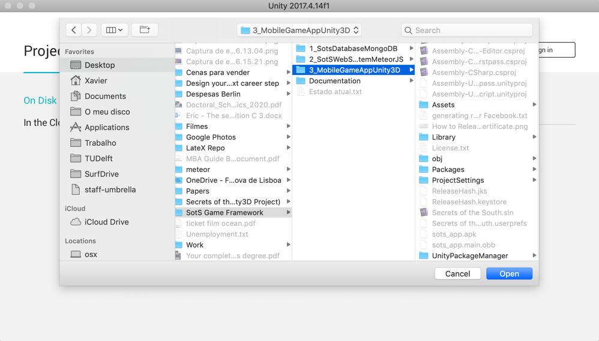
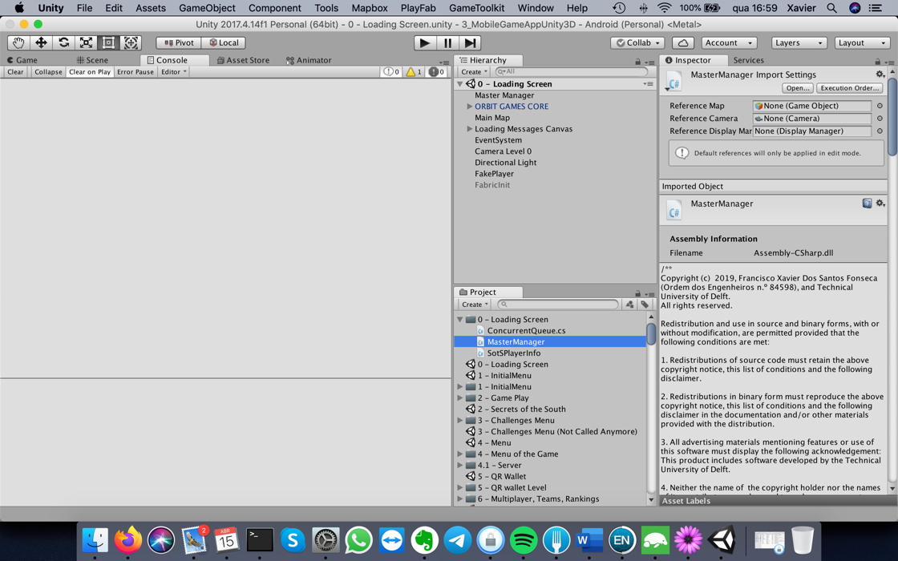
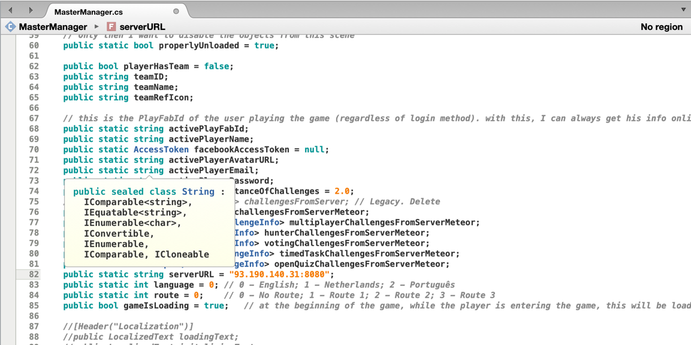

**Secrets of the South: How to install and run the game framework**

Introduction
------------

For you to be able to run the Secrets of the South (SotS) game framework, you
need to have two system components working: 1) the SotS Custom system, and 2)
the mobile game. At the end, you will also need to be able to create user
accounts, firstly to the SotS Custom system (to create game content), and others
for the mobile game (to enter and play the game with the smartphone).

SotS Custom system
------------------

In order to run the game, you need to have an online server that is capable of
running two things: a node.js runtime environment, and an instance of a MongoDB
database. The node.js runtime environment will be responsible for running the
demeteorized application that was created through the meteorJS web platform.
This online application is responsible for serving all the challenges to the
mobile application up to a given radius from the player's location. This
application is also a participatory system, a system where player and
non-players can contribute to the game play by creating their own challenges
(and thus act as contributors). By doing so, contributors take partial ownership
of the SotS game, and actively participate in the creation of a play experience
that is based on their own preferences, and knowledge on what their
neighbourhood has to offer.

On top of the node.js environment, you need to have the persistence layer set up
to serve the meteor application. This database will be responsible for storing
the mentioned challenges, but also several details from the game play on the
mobile application. The information stored in the database is:

-   List of challenges (of several types: Quiz, Multiplayer, Hunter, Voting,
    Timed Task, and Open Quiz);

-   The player's GPS location (with a frequency of 5 seconds);

-   Game events (when a challenge is opened, closed, or solved, players scanning
    another player, player joining a team, player finding a QR code of a
    challenge);

-   Team events and rankings (how many Multiplayer challenges a team solved --
    measured by the evaluations received; and the average of all the evaluations
    they got);

-   Game permissions (players in the mobile game have permissions, and, based on
    these, they can access different functionality of the game: Administrators,
    Evaluators, and simply Players). Administrators can manage other player's
    permissions; Evaluators can rate the performance of teams in Multiplayer
    challenges; Players have the basic functionality of the game, which is to
    solve challenges and engage with people;

-   User accounts for the online website, where players can publish challenges
    and take partial ownership of the game;

### SotS database

In order to run the meteorJS online application, you need to have the MongoDB
set up first. We used "Studio 3T"[^1], but you can use another method of your
choosing. For you to create a DB, fire your terminal and do the following
commands (I used MacOS, but for other installations, please refer to these
locations[^2][^3][^4]):

[^1]: <https://studio3t.com/>, last visited on 15th Apr. 2020

[^2]: <https://docs.mongodb.com/manual/tutorial/install-mongodb-on-os-x/> , last
visited on 15th Apr. 2020

[^3]: <https://www.tutorialspoint.com/mongodb/mongodb_create_database.htm> ,
last visited on 15th Apr. 2020

[^4]: <https://www.guru99.com/create-read-update-operations-mongodb.html> , last
visited on 15th Apr. 2020

-   cd \~/Desktop/

-   mkdir SotS\\ Game\\ Framework

-   cd SotS\\ Game\\ Framework

-   mkdir 1_SotsDatabase

-   cd 1_SotsDatabase/

-   mongod --dbpath .

You should see: [initandlisten] waiting for connections on port 27017

Open another terminal window:

-   mongo

-   db.createUser({user:"researcher", pwd:"researcher", roles:["dbOwner"]});

You should see:

Successfully added user: { "user" : "researcher", "roles" : [ "root" ] }

-   db.shutdownServer();

-   exit;

Restart the database normally:

-   mongod --auth --dbpath .

Change terminal window, and reconnect to the server:

-   mongo

-   db.auth("researcher", "researcher");

-   use SotS

-   db.createUser( { user: "sots", pwd: "sots", roles: [{ role: "readWrite", db:
    "SotS" }]} )

From here, you can use Studio 3T to connect to the database you created, and see
if it works:

 

Figure 1: Give a name to the Database

 

Figure 2: Configure the user accessing, the password, authentication algorithm
used, and the database used.

 

Figure 3: Connection established.

**From this point onwards, you can execute the bash file in the folder
"1_SotsDatabaseMongoDB/" to start the database:**

-   cd 1_SotsDatabaseMongoDB/

-   sh startMongoDB.sh

Database is now accessible under **127.0.0.1:27017**

### Create admin account on Playfab.Com

The meteorJS online application can be found under the folder
"2_SotSWebSystemMeteorJS/", attached in this repository. For you to run the
server and have it communicating with all the parts, you need to create an admin
account in "http://Playfab.com".

 

Click on sign up, enter your details, verify your email account, and finish up
writing the rest of your details on the platform. Once this is done, you have to
create the SotS user administration account on Playfab. Put some basic
information, call your application SotS, and click on create title (not really
relevant what you write here):

 

Click on the rod on the top left corner, on the title settings. Click on API
features, and copy the "Title ID" of the application just created (in this case:
336E0):

 

Write this down, you will need this.

### Configure and run SotS Custom Server

First, install the MeteorJS web platform in your computer[^5]. Then, you need to
configure your your server with your details. For that, go into the folder
2_SotSWebSystemMeteorJS and change each individual file identified below.

[^5]: <https://www.meteor.com/install>, Install MeteorJS in your system, last
visited on 15th Apr. 2020

#### Make it yours

Please put your email address in the following files (replace
<yourEmail@emailProvider.com> with your own email address):

Client/Admin.js

Imports/startup/server/JsonRoutes.js

Imports/startup/server/MyMethods.js

Client/Footer.html

#### Integrate it with Playfab

Please change the server in order to integrate with Playfab, by altering the
following files:

Playfab/PlayFabServerApi.js

In this file, please change titleId and developerSecretKey to those given by
Playfab. In this example:

 

Lastly, to start the website, run the command:

-   cd 2_SotSWebSystemMeteorJS/

-   sh startSecretsOfTheSouthMeteorApp.sh

You should be seeing the following message:

=\> App running at: http://localhost:3000/

From here, you can open up your browser and visit the address
"http://localhost:3000".

 

Once it is opened, you can create a login account by clicking on the top right
corner of the page.

#### Create the administrator account (in case it doesn't exist already)

This is already done under Git code provided, but still, the step is documented.
You have to create the administrator account, responsible for the management of
all challenges of the game and users. This is hardcoded in the game with the
following credentials (for this to change, you should change the files
*/client/Admin.js*, and */client/header.js*):

Username: administrator

Password: administrator

You can create further user accounts later on, but the administrator account
aforementioned should be created for the management of the content throughout
the game play. You can create several challenges with your account (or other
ones that aren't the admin account aforementioned), and you should approve these
challenges with the admin administrator, before being able to see them in the
mobile application.

### Make the SotS Custom System public

For the mobile game to be able to talk both to SotS Custom system and its
database, you have to make them accessible from the outside of your computer. I
recommend nginx for \*nix-based systems, and I have sett mine up under OSX.
Please install nginx (for OSX, follow this[^6], for Ubuntu this[^7]). Once you
install it, run it:

[^6]: <https://www.hrupin.com/2017/11/how-to-install-nginx-webserver-on-mac-os-x>,
Install nginx under OSX, last visited on 15th Apr. 2020

[^7]: <https://www.digitalocean.com/community/tutorials/how-to-install-nginx-on-ubuntu-16-04>,
Install nginx under Ubuntu, last visited on 15th Apr. 2020

-   Sudo nginx

If you ever want to stop it, run:

-   nginx -s stop

You can put the following standard address on your brower, and you should have
the standard page being shown: *http://127.0.0.1:8080*.

 

You can also run the alternative command to verify that it's running under the
port stipulated:

-   curl -IL http://127.0.0.1:8080

 

Now, stop it again:

-   nginx -s stop

Next, you need to configure nginx to expose two things: your MeteorJS
application server. Please open the following file under you favourite editor,
or replace the following configuration file with the one I am providing you
(under "2_SotSWebSystemMeteorJS/nginx.conf"):

-   cp 2_SotSWebSystemMeteorJS/nginx.conf /usr/local/etc/nginx/nginx.conf

This path is of course different under a different system than OSX (I believe in
linux it might be installed under /etc/).

If you open the configuration file I am providing, you can notice that I am
exposing the Meteor application that opens in <http://localhost:3000> under the
port 8080, so that any income connections for your public IP address of your
computer, under the port 8080, will be redirected to the actual running server.
You can find your public address in public websites such as
<https://whatismyipaddress.com/>. Imagine it gives you the following address:

 

This means that we are going to have to configure the mobile game application to
access our SotS Custom Server through the address 93.190.140.31:8080 to have the
game running and working with the challenges put in our server.

At this point, run nginx again, and you should be good to go:

-   Sudo nginx

SotS mobile game
----------------

Now, open your Unity3D development environment. If you do not have it installed
yet, consider installing the version 2017.4.14f1 (has mono developer with it).
Then, locate and select the project's folder: 3_MobileGameAppUnity3D and click
open:

 

Also bear in mind that, for you to run this game, you will have to install a few
plugins into Unity3D, namely the ones from **Mapbox**, and **Playfab**. Then,
locate the file "MasterManager", and open it up:

 

You need to change the line 82 with the server URL for the server you installed
beforehand (currently "**secretsofthesouth.tbm.tudelft.nl**"). In our example,
it becomes "**93.190.140.31:8080**":

 

You can install the android application "Unity Remote 5", and play the game
inside Unity SDK (figure below):

 

By playing the game inside the Unity3D environment, fake GPS coordinates will be
used, and you will get to play the game under the user "Beauty". Play around
with the game, and then when you see that everything works and integrated, you
can deploy the game directly into your phone.

To do that, turn your Android smartphone's developers mode ON[^8]. Then, connect
it to your computer via cable. Then, you can press CTRL+ALT+B and build it into
your smartphone.

[^8]: <https://www.greenbot.com/article/2457986/how-to-enable-developer-options-on-your-android-phone-or-tablet.html>
, last visited on 15th Apr. 2020

At this stage, you can add challenges online in the website in the previous
step, and you can see them appearing after sometime into the 3D game.

Setting up of player login accounts for the mobile application
--------------------------------------------------------------

Accounts have to be created in the Playfab platform (chapter 2.2) in order for a
player to enter the game with its newly created credentials. Please go to this
platform now. Each player to be able to enter the game requires a QR code
identification, which needs to exist beforehand. New accounts are created by the
Playfab title administrator: h/she clicks on Players -\> New Player, and then a
new custom ID is generated. Next, he clicks on Create and Login Player, and a
new webpage containing the new player is shown. In here, the administrator can
set a default avatar through a URL, and, among other secondary things, the
Playfab Username and Password. The administrator needs to set the same string of
characters under username and password, and in the password, the suffix
"@sots.nl" needs to be added. As an example, it can be seen on Figure 11 that
the player Player 5: "D986F00C78B299F0" was the result of the creation of a new
player on the system.

The administrator then should scroll down and set the username of the player as
"D986F00C78B299F0", and its password as "D986F00C78B299F0\@sots.nl", without
quotation marks (simpler names can be used, e.g. "player_5").

 

Figure 11: Inserting a new player in the Playfab backend system

Once this is done, the administrator of the Playfab system needs to create a QR
code id with this new user. He can use any online tool for that (example[^9]).
The SotS uses a coding scheme for QR codes, which should follow the following
convention for the QR code to be used to log into the mobile application:

[^9]: <https://www.qr-code-generator.com/>, QR Code Generator, last visited on
15th Apr. 2020

[SotS Custom
Server/HandleQRCode/_0x001b00_PlayerID](http://secretsofthesouth.tbm.tudelft.nl/HandleQRCode/_0x001b00_PlayerID)

where *PlayerID* is the User ID just created by the administrator in Playfab.
For our example (user D986F00C78B299F0), the text to be used in the creation of
the QR code is:

<http://secretsofthesouth.tbm.tudelft.nl/HandleQRCode/_0x001b00_D986F00C78B299F0>

A resulting QR code, created in an external tool, for this Player 5 would be:

 

Figure 12: Example of QR code for logging into the SotS mobile game application:
Player 5.

This QR code can now be sent by the administrator to the player, to be used in
turn by the mobile application of the SotS game in the login process. The player
only needs to scan it once with the smartphone (inside the game).

Hope you enjoy it :)

 

 

Eng. **Xavier Fonseca**

<https://www.linkedin.com/in/xavier-fonseca/>

15th Apr. 2020
